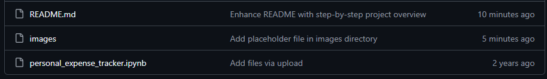
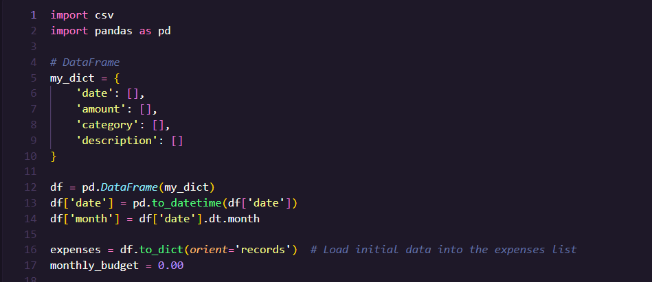
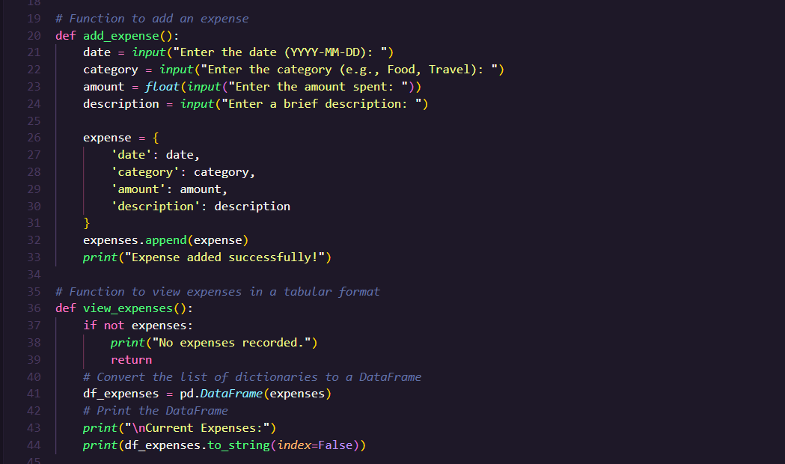
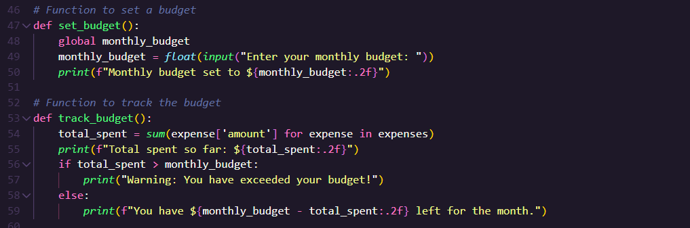
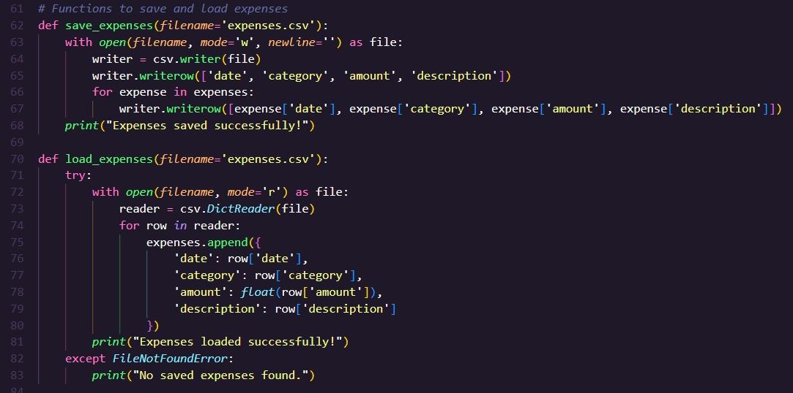
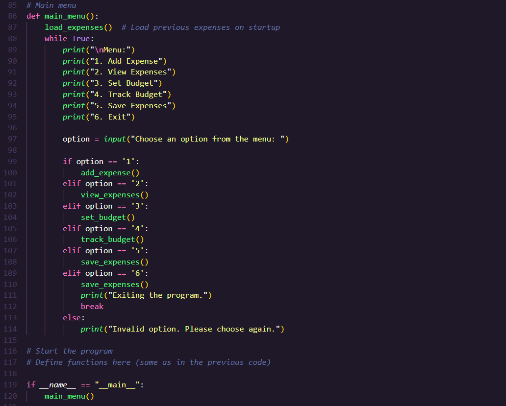

## Overview

This project is a Python-based personal expense tracker designed to demonstrate core programming concepts including data handling, user input processing, file persistence, and basic financial logic.

The application allows users to:
- Record expenses
- View spending in a structured format
- Set and track a monthly budget
- Save and load expense data using CSV files

## Tools and Technologies

- Python
- Pandas
- CSV (file handling)
- Jupyter Notebook

## What Employers Should Notice

- Ability to design a structured, menu-driven application
- Use of functions to organize program logic
- Data handling using dictionaries and Pandas DataFrames
- Implementation of file persistence using CSV
- Use of conditional logic for real-world scenarios (budget tracking)
- Clean project organization and documentation

## Results

- Built a functional command-line expense tracker
- Implemented data storage and retrieval
- Demonstrated ability to structure and document a Python project

## Future Improvements

- Add input validation for user entries
- Implement category-based spending summaries
- Add data visualization (charts/graphs)
- Convert to a GUI or web application

## Step-by-Step Walkthrough

### 1. Project Files

The repository contains the main Jupyter Notebook and README documentation for the expense tracking project.

### 2. Imports and Data Setup

The project imports `csv` and `pandas`, initializes an empty expense structure, converts the date field into a datetime format, and prepares the expense list for program use.

### 3. Add and View Expenses

The `add_expense()` function collects date, category, amount, and description from the user. The `view_expenses()` function converts the expense records into a Pandas DataFrame for cleaner table-style output.

### 4. Budget Tracking

The `set_budget()` function stores a monthly budget, while `track_budget()` calculates total spending and compares it against the user’s budget.

### 5. Save and Load Expenses

The project uses CSV file handling to save expense records and reload them later, giving the tracker basic data persistence.

### 6. Main Menu Program Flow

The `main_menu()` function ties the project together with a simple menu-driven interface for adding, viewing, budgeting, saving, and exiting the program.

